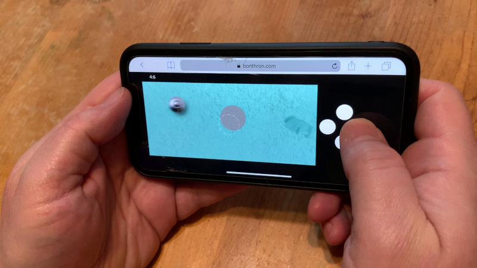
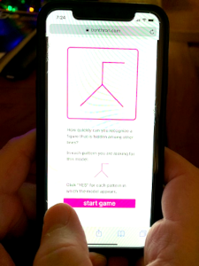

### For the Moon is Hollow and I Have Touched the Sky
Game entry for GitHub - Itch.io "Game Off" Game Jam

#### Play it here: [https://www.bonthron.com/moon](https://www.bonthron.com/moon)

This is an HTML5 game for mobile and desktop.
This is my game entry to <i>Game Off</i> - GitHub's annual game jam, where participants spend one month creating a game based on a secret theme. The theme for this year’s jam was "MOONSHOT".

Itch.io: [https://bonthron.itch.io/moon](https://bonthron.itch.io/moon)

___

### Algorithms + Data Structures 1976

Revisiting Niklaus Wirth's classic book. 45 years later- it remains highly relevant. \
The code examples are Pascal. Amazingly, the code compiles (unchanged) using the 2020 version of Free Pascal.

In addition to the original Pascal, I'm re-working the algorithms in **Scheme, JavaScript**, and **Python**. \
Hacking Pascal is old school fun !

[wirth repo](https://github.com/bonthron/wirth1976)

___

# FlexibilityOfClosure
HTML5 puzzle for mobile and desktop: Find a hidden pattern in geometrical configuration.

*Flexibility of Closure* is the cognitive ability to hold a given visual percept or configuration in mind so as to disembed it from other well defined perceptural material.

#### Play: [https://www.bonthron.com/FlexibilityOfClosure](https://www.bonthron.com/FlexibilityOfClosure)

___

**3.1415 contributions this year:**

   
  

